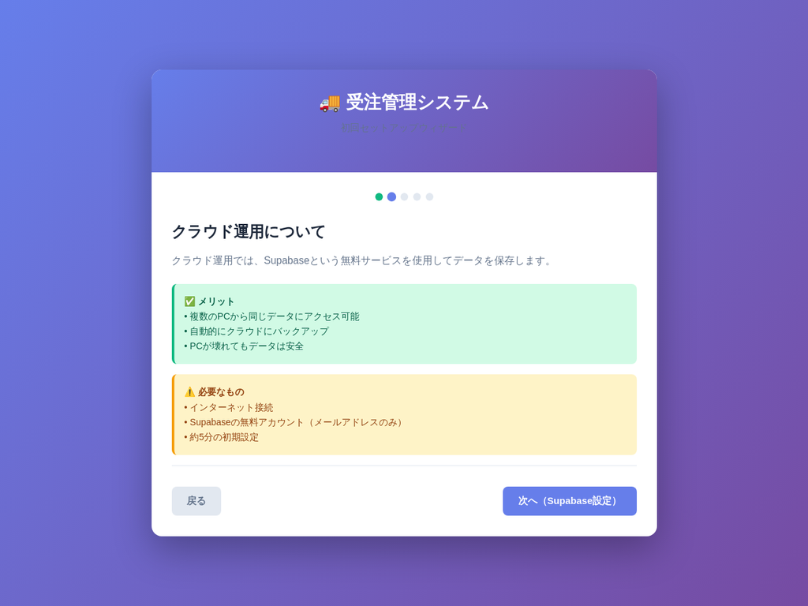
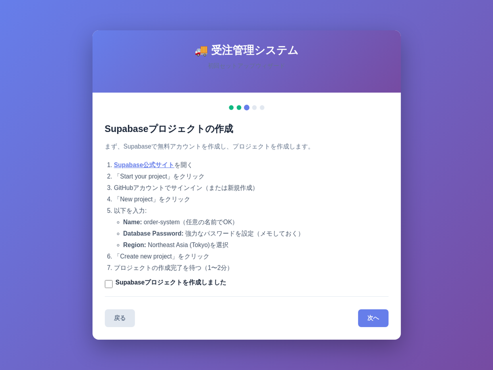
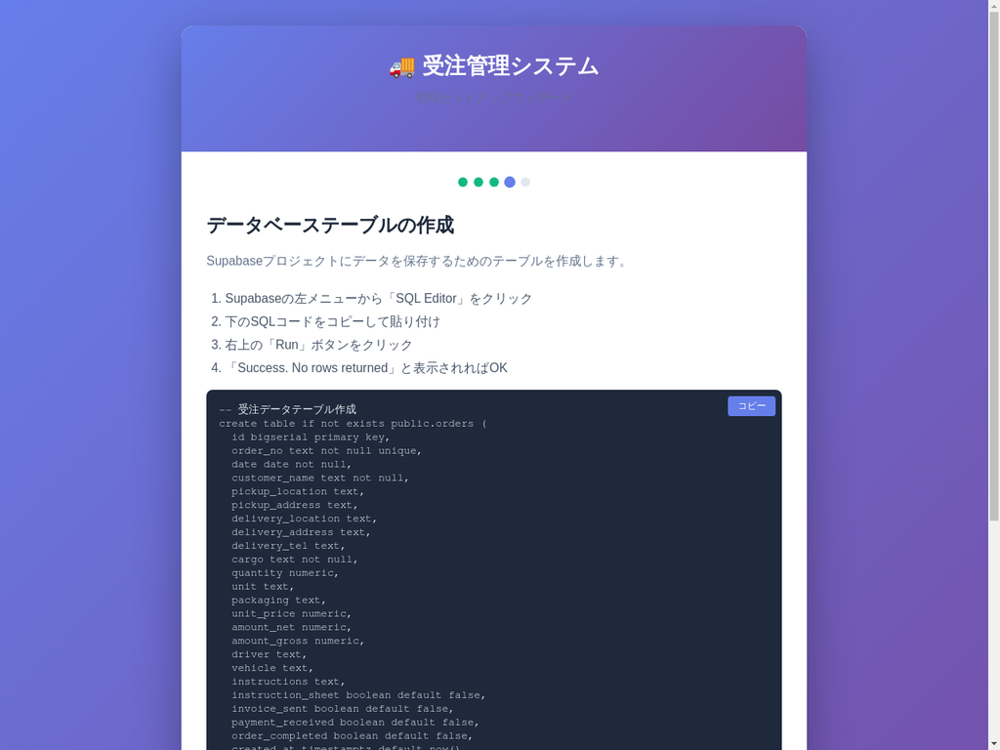
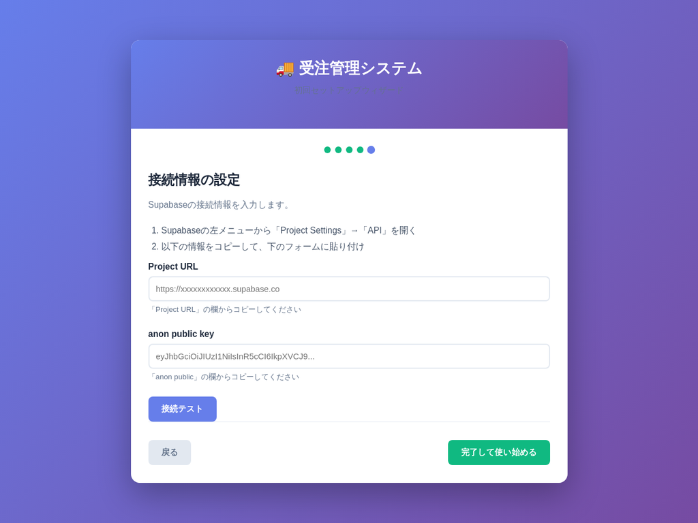

# 受注管理システム かんたん運用マニュアル

## はじめに

このマニュアルは、新しくなった「受注管理システム」のセットアップ方法と基本的な使い方を、非エンジニアの方でも分かりやすいように解説します。

### このシステムでできること

- **受注管理**: 日々の受注を登録・編集・管理
- **マスタ管理**: 顧客やドライバー情報を簡単登録
- **印刷・出力**: 運行指示書や請求書用CSVをワンクリックで
- **データ共有**: 複数PCで同じデータを共有（クラウド設定時）

### 選べる2つの使い方

1.  **💻 このPCだけで使う（ローカル運用）**
    - 設定不要ですぐに使える
    - データは今使っているPCに保存
2.  **☁️ 複数のPCで共有する（クラウド運用）**
    - 複数のPCでデータを共有できる
    - 無料のSupabaseサービスを利用（かんたん設定）

それでは、さっそくセットアップを始めましょう！

---

## 1. セットアップ手順

初めてシステムを起動すると、自動的にセットアップウィザードが表示されます。

### ステップ1: ようこそ

まず、システムの利用方法を選択します。

- **このPCだけで使う場合**: 「💻 このPCだけで使う」をクリックします。
- **複数のPCで共有する場合**: 「☁️ 複数のPCで共有する」をクリックします。

---

### ステップ2: クラウド運用について

「クラウド運用」を選択すると、メリットと必要なものが表示されます。内容を確認し、「次へ（Supabase設定）」をクリックします。

---

### ステップ3: Supabaseプロジェクトの作成

画面の指示に従って、Supabaseで新しいプロジェクトを作成します。

1.  「Supabase公式サイト」のリンクをクリックして公式サイトを開きます。
2.  画面の指示に従ってアカウントを作成し、新しいプロジェクトを作成します。
3.  プロジェクトが作成できたら、チェックボックスにチェックを入れて「次へ」をクリックします。

---

### ステップ4: データベーステーブルの作成

次に、データを保存するためのテーブルをSupabaseに作成します。

1.  Supabaseの管理画面で「SQL Editor」を開きます。
2.  ウィザードに表示されているSQLコードを「コピー」ボタンでコピーし、SupabaseのSQL Editorに貼り付けます。
3.  「Run」ボタンをクリックします。
4.  完了したら、チェックボックスにチェックを入れて「次へ」をクリックします。

---

### ステップ5: 接続情報の設定

最後に、Supabaseの接続情報をシステムに設定します。

1.  Supabaseの管理画面で「Project Settings」→「API」を開きます。
2.  「Project URL」と「anon public key」をコピーし、ウィザードの対応する欄に貼り付けます。
3.  「接続テスト」ボタンをクリックして、緑色の「✅ 接続成功！」メッセージが表示されることを確認します。
4.  「完了して使い始める」をクリックします。

これでセットアップは完了です！

---

## 2. 基本的な使い方

セットアップが完了すると、メインの受注管理画面が表示されます。

- **新規受注**: 右上の「＋ 新規受注」ボタンから新しい受注を登録します。
- **編集・削除**: 各受注の行にあるボタンから操作します。
- **マスタ管理**: 右上のメニューから顧客やドライバーなどの情報を管理できます。
- **データ同期**: クラウド設定が有効な場合、データは自動的に同期されます。

## 3. よくある質問（Q&A）

**Q: データはどこに保存されますか？**

A: ローカル運用の場合はお使いのPCのブラウザ内、クラウド運用の場合はSupabaseのデータベースに保存されます。

**Q: バックアップは必要ですか？**

A: はい。特にローカル運用の場合は、定期的に「CSV出力」機能でバックアップを取ることを強くお勧めします。

**Q: 複数のPCで使いたいのですが、後からクラウド運用に切り替えられますか？**

A: はい、可能です。右上の「クラウド設定」からいつでも設定を変更できます。

